# Troica AWS Architecture (상세)

`msa-provisioning` Terraform이 만드는 모든 AWS 리소스를 레벨별로 분할 시각화.

> 검증 기준: 각 리소스의 정확한 scope (계정/리전/VPC/AZ/Subnet) + 트래픽 방향.
> 자세한 코드: [msa-provisioning/terraform](https://github.com/KTCloud-CloudNative-Troica-Team/msa-provisioning/tree/main/terraform)
>
> **누적 변경**:
> - R-59 (msa-provisioning PR #13): worker 사양 t3.medium → t3.large (Phase 5 메모리 대비)
> - R-35 (d) / PR #22: NLB 에 Istio Gateway path 추가 — listener 80/443, target group istio-http-tg (30080) + istio-https-tg (30443), worker 3 attachment × 2 port, cluster-node-sg ingress 30080/30443 from `0.0.0.0/0`

---

## 1. Network 레이어 (VPC + AZ + Subnet + IGW + NAT + NLB)

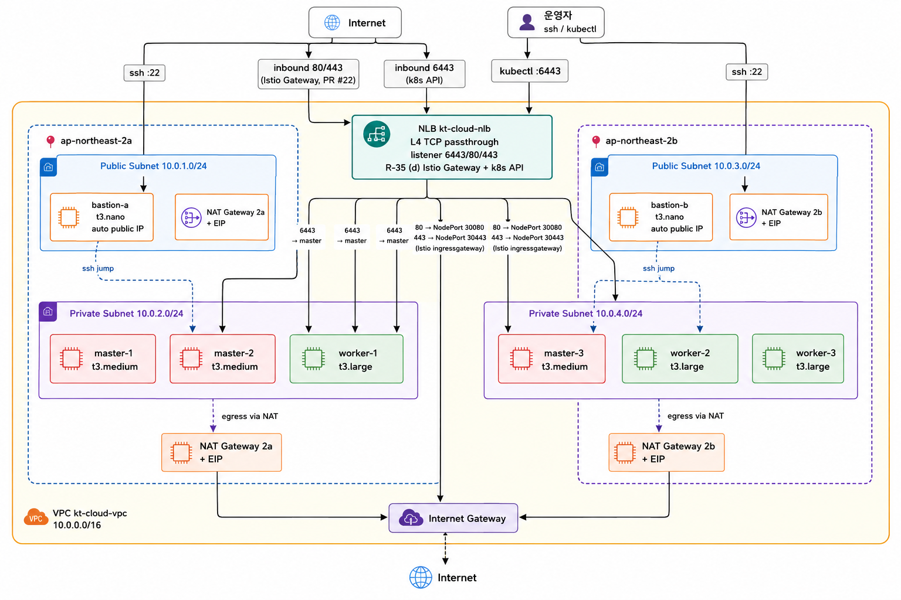

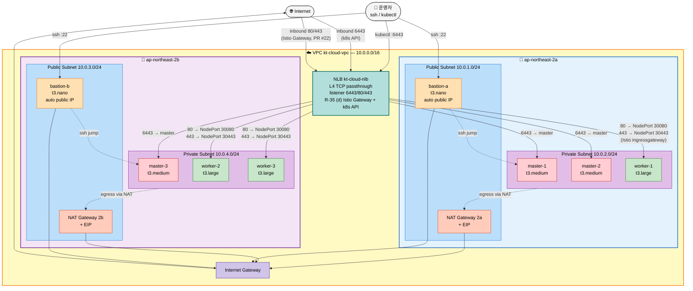

**검증 포인트**:
- VPC `10.0.0.0/16`, subnet 4개 (public/private × 2 AZ)
- NLB는 양 AZ public subnet에 attach (subnet_mapping × 2 + EIP × 2)
- **NLB listener 3개**: 6443 (k8s API → master target group) + 80 (HTTP) + 443 (HTTPS) → worker NodePort 30080/30443 → istio-ingressgateway (PR #22, R-35 (d) Istio Gateway 외부 진입 path)
- private subnet의 egress는 각 AZ의 NAT 경유 → IGW (route 분리)
- bastion만 public subnet (외부 SSH 진입). 별도 bastion subnet 없음. `associate_public_ip_address=true` 의 auto public IP (EIP attach 아님)
- master 3대 (2a:2 + 2b:1, t3.medium), worker 3대 (2a:1 + 2b:2, **t3.large** - R-59 메모리 상향)

---

## 2. Compute + Storage (EC2 + EFS + EBS + VPC Endpoint)

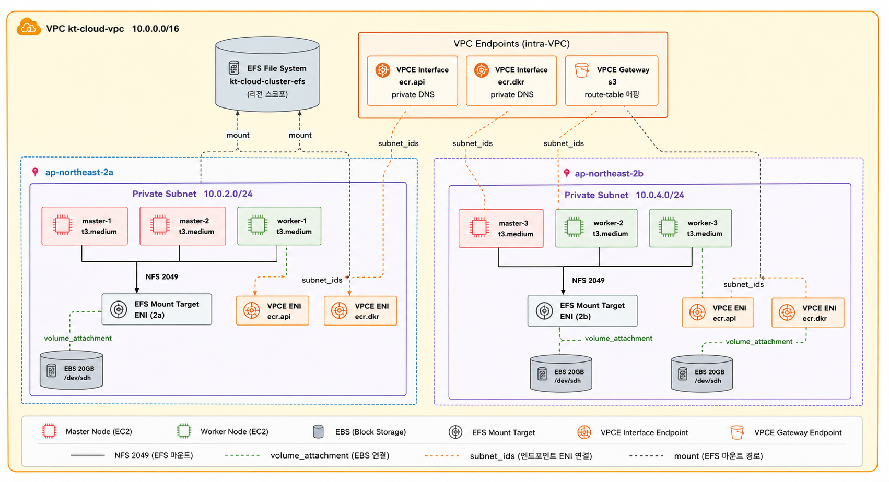

```mermaid
flowchart LR
  subgraph VPC["☁️ VPC kt-cloud-vpc"]
    direction TB

    subgraph EndpointGroup["VPC Endpoints (intra-VPC)"]
      direction LR
      VPCE_API["VPCE Interface<br/>ecr.api<br/>private DNS"]
      VPCE_DKR["VPCE Interface<br/>ecr.dkr<br/>private DNS"]
      VPCE_S3[("VPCE Gateway<br/>s3<br/>route-table 매핑")]
    end

    EFS[("EFS File System<br/>kt-cloud-cluster-efs<br/>리전 스코프")]

    subgraph AZ2A["📍 ap-northeast-2a"]
      subgraph PriA["Private Subnet 10.0.2.0/24"]
        MA1["master-1<br/>t3.medium"]
        MA2["master-2<br/>t3.medium"]
        WA["worker-1<br/>t3.medium"]
        EBSa["EBS 20GB<br/>/dev/sdh"]
        EFSmA["EFS Mount Target<br/>ENI (2a)"]
        ENI_A_API["VPCE ENI<br/>ecr.api"]
        ENI_A_DKR["VPCE ENI<br/>ecr.dkr"]
      end
    end

    subgraph AZ2B["📍 ap-northeast-2b"]
      subgraph PriB["Private Subnet 10.0.4.0/24"]
        MB1["master-3<br/>t3.medium"]
        WB1["worker-2<br/>t3.medium"]
        WB2["worker-3<br/>t3.medium"]
        EBSb1["EBS 20GB<br/>/dev/sdh"]
        EBSb2["EBS 20GB<br/>/dev/sdh"]
        EFSmB["EFS Mount Target<br/>ENI (2b)"]
        ENI_B_API["VPCE ENI<br/>ecr.api"]
        ENI_B_DKR["VPCE ENI<br/>ecr.dkr"]
      end
    end
  end

  WA -.volume_attachment.- EBSa
  WB1 -.volume_attachment.- EBSb1
  WB2 -.volume_attachment.- EBSb2

  EFS -.mount.- EFSmA
  EFS -.mount.- EFSmB
  MA1 & MA2 & WA -->|NFS 2049| EFSmA
  MB1 & WB1 & WB2 -->|NFS 2049| EFSmB

  VPCE_API -.subnet_ids.- ENI_A_API
  VPCE_API -.subnet_ids.- ENI_B_API
  VPCE_DKR -.subnet_ids.- ENI_A_DKR
  VPCE_DKR -.subnet_ids.- ENI_B_DKR

  classDef vpc fill:#fff9c4,stroke:#f57f17,stroke-width:2px,color:#000
  classDef az2a fill:#e3f2fd,stroke:#1565c0,stroke-width:2px,color:#000
  classDef az2b fill:#f3e5f5,stroke:#6a1b9a,stroke-width:2px,color:#000
  classDef pri fill:#e1bee7,stroke:#7b1fa2,color:#000
  classDef master fill:#ffcdd2,stroke:#c62828,color:#000
  classDef worker fill:#c8e6c9,stroke:#2e7d32,color:#000
  classDef storage fill:#cfd8dc,stroke:#37474f,color:#000
  classDef vpce fill:#fff3e0,stroke:#e65100,color:#000
  classDef eni fill:#ffe0b2,stroke:#ef6c00,color:#000

  class VPC vpc
  class AZ2A az2a
  class AZ2B az2b
  class PriA,PriB pri
  class MA1,MA2,MB1 master
  class WA,WB1,WB2 worker
  class EBSa,EBSb1,EBSb2,EFS,EFSmA,EFSmB storage
  class VPCE_API,VPCE_DKR,VPCE_S3,EndpointGroup vpce
  class ENI_A_API,ENI_A_DKR,ENI_B_API,ENI_B_DKR eni
```

**검증 포인트**:
- EBS는 worker × 3에만 부착 (master/bastion은 root volume만)
- EFS는 리전 스코프, 각 AZ private subnet에 mount target ENI 1개씩
- VPC Endpoint Interface (ecr.api / ecr.dkr): 양 AZ private subnet에 ENI (subnet_ids로 attach)
- VPC Endpoint Gateway (s3): route table 매핑 (private RT × 2) — 본 그림에서는 ENI 없는 별개 표시

---

## 3. Security Groups + 트래픽 흐름

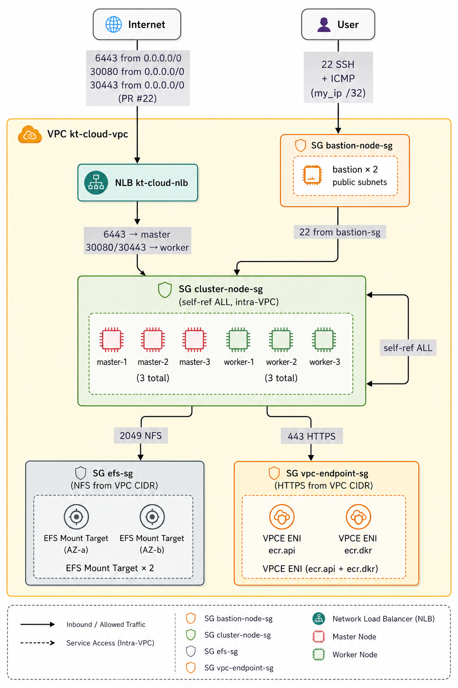

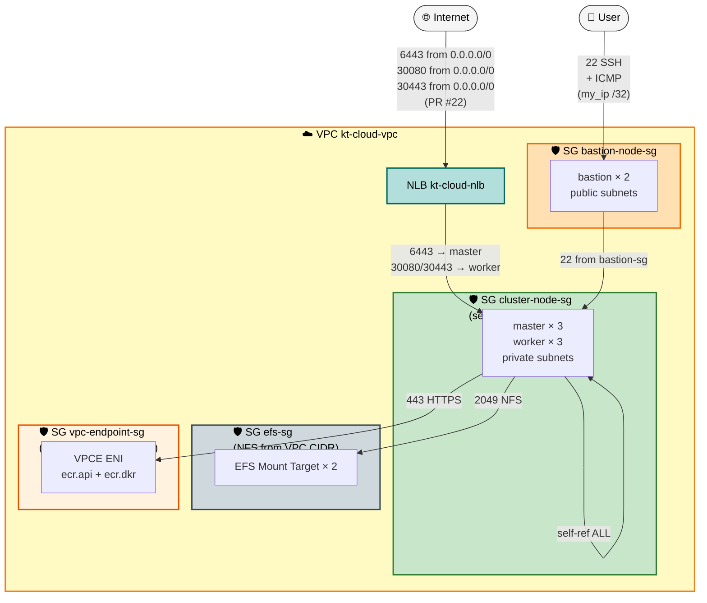

**검증 포인트**:
- `bastion-node-sg`: SSH 22 + ICMP only from `data.http.my_ip` (운영자 PC IP `/32`)
- `cluster-node-sg` ingress:
  - 6443 from `0.0.0.0/0` (NLB → master k8s API)
  - **30080 from `0.0.0.0/0`** (PR #22, NLB → worker NodePort http) — `aws_security_group_rule.cluster_node_istio_http_ingress`
  - **30443 from `0.0.0.0/0`** (PR #22, NLB → worker NodePort https) — `aws_security_group_rule.cluster_node_istio_https_ingress`
  - intra-VPC TCP/UDP/ICMP from `10.0.0.0/16`
  - SSH 22 from `bastion-node-sg`
- `cluster-node-sg` self-ref (`aws_security_group_rule.cluster_node_self_ingress`): 같은 SG 멤버끼리 ALL protocol → Calico IP-in-IP / worker ↔ master 통신
- **NLB source IP preservation** = true (default for instance target) → client public IP 가 worker 까지 그대로 → SG 의 30080/30443 `0.0.0.0/0` ingress 필수 (없으면 NLB listener 추가해도 SG drop)
- `efs-sg`: NFS 2049 from `10.0.0.0/16` (intra-VPC)
- `vpc-endpoint-sg`: HTTPS 443 from `10.0.0.0/16` (intra-VPC)

---

## 4. CI/CD — GitHub Actions OIDC → ECR push

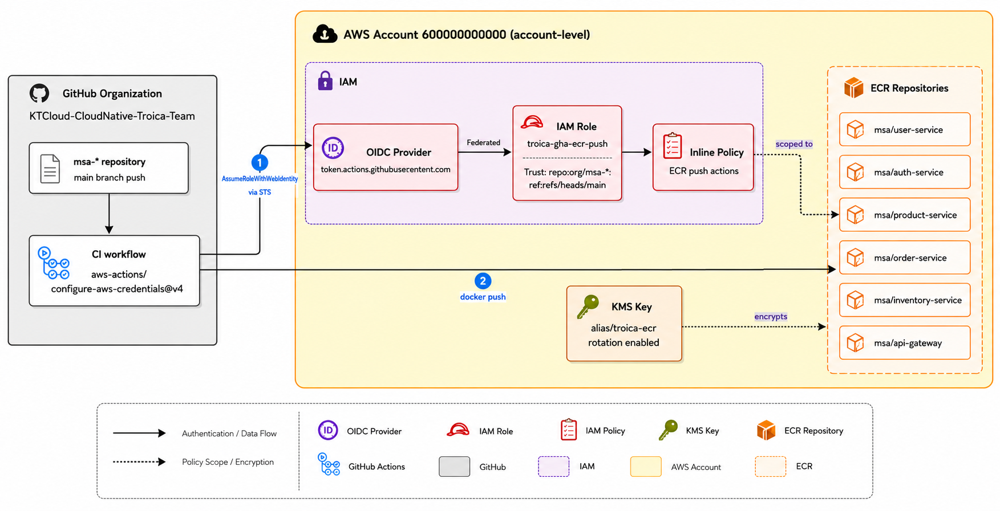

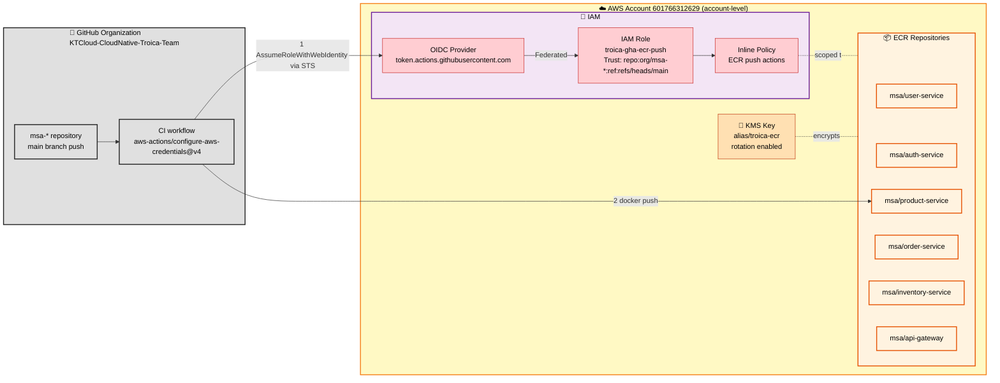

**검증 포인트**:
- IAM OIDC Provider, IAM Role (`troica-gha-ecr-push`), Policy 모두 **계정 레벨** (VPC 외부)
- Trust policy 조건: `repo:KTCloud-CloudNative-Troica-Team/msa-*:ref:refs/heads/main` — main 브랜치만 assume 허용
- IAM Role의 name-based ARN → destroy/apply 사이클 안정 (GitHub Org Secret `AWS_ACCOUNT_ID` 영구 유효)
- ECR Repo × 6, KMS 암호화, IMMUTABLE tag, 30-image lifecycle

---

## 5. EC2 노드의 ECR Image Pull (kubelet 경로 — CI push와 별개)

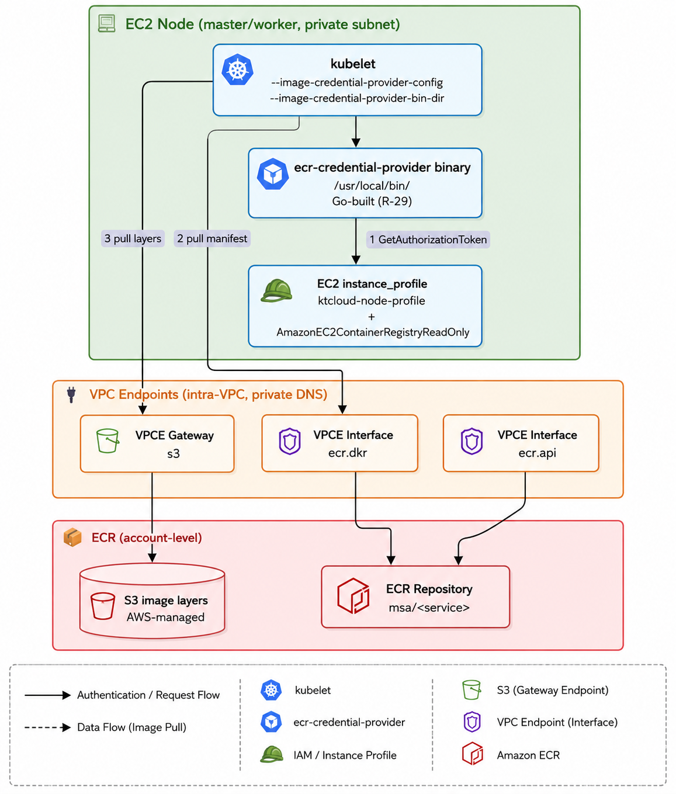

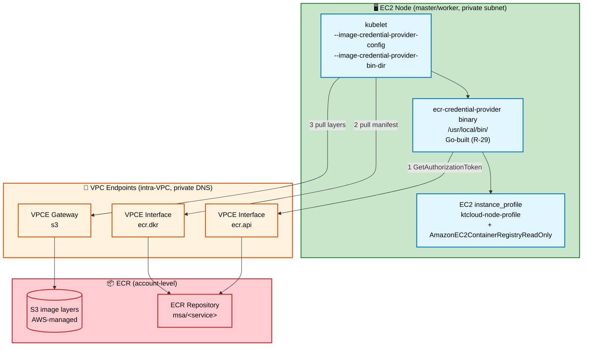

**검증 포인트**:
- CI push와 별개 경로 — kubelet의 ECR pull은 instance profile (`AmazonEC2ContainerRegistryReadOnly`) 사용
- ecr-credential-provider는 GitHub release에 binary 없음 → Go 빌드 후 ansible copy (R-29)
- kubelet args 적용: drop-in 미평가 회피 위해 `kubeadm-flags.env` 직접 통합 (R-30)
- 트래픽: ECR API/DKR은 VPCE Interface, 이미지 layer는 S3 Gateway endpoint

---

## 6. 영구 / 임시 / 수동 자원 분류

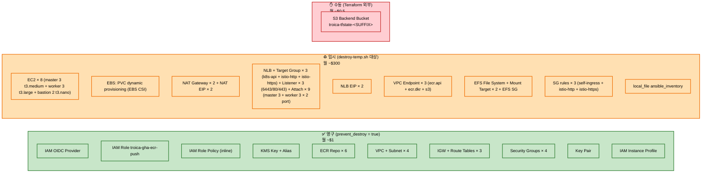

---

## 7. 통합 토폴로지 (한 화면 요약)

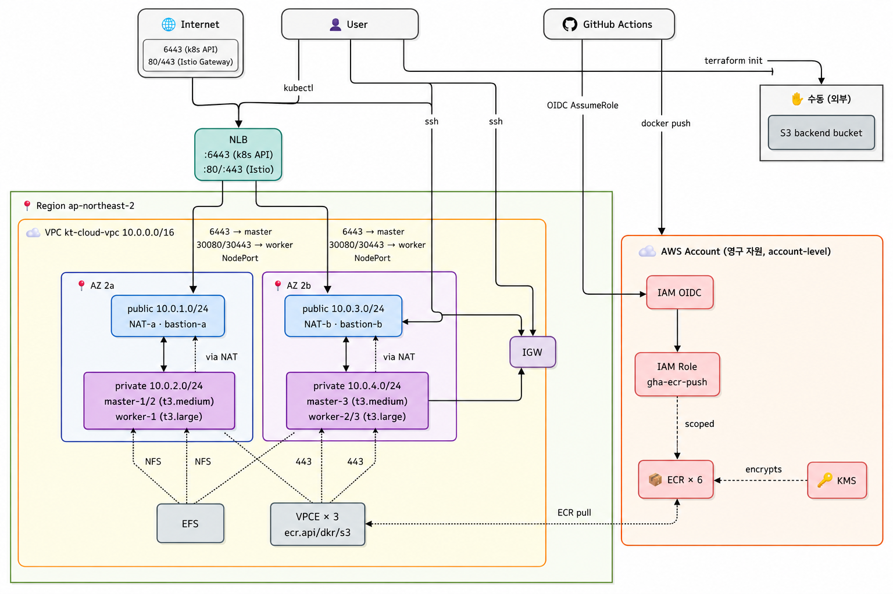

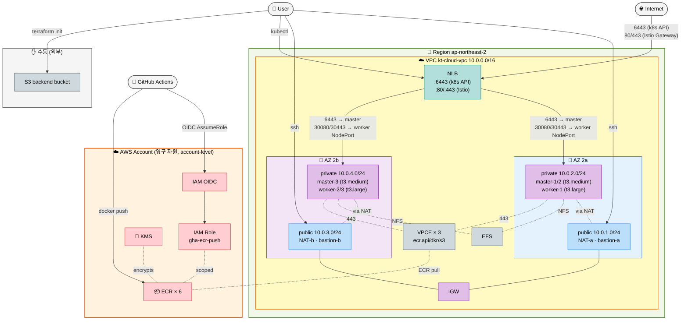

---

## 검증 체크리스트

- ✅ VPC CIDR `10.0.0.0/16`, 4개 subnet CIDR 정확
  - Public 2a `10.0.1.0/24` + Public 2b `10.0.3.0/24` (NAT Gateway + bastion)
  - Private 2a `10.0.2.0/24` + Private 2b `10.0.4.0/24` (master/worker/EFS Mount Target/VPC Endpoint ENI)
- ✅ public subnet에 IGW 경유 / private subnet에 NAT 경유 (route table 분리, RT × 3)
- ✅ NLB는 subnet_mapping으로 양 AZ public subnet에 attach + 각 AZ EIP
- ✅ **NLB listener × 3** = 6443 (k8s API → master target group) + 80 (HTTP → istio-http-tg) + 443 (HTTPS → istio-https-tg) — R-35 (d) / PR #22
- ✅ **NLB target group × 3** = k8s-api-tg (6443, master × 3) + istio-http-tg (30080, worker × 3) + istio-https-tg (30443, worker × 3) — attachment 9 개
- ✅ bastion은 public subnet (`associate_public_ip_address=true`, EIP attach 아님). 별도 bastion subnet 없음
- ✅ master/worker는 private subnet + instance profile (`ktcloud-node-profile`)
  - master 3 × t3.medium (control plane only)
  - worker 3 × **t3.large** (R-59 메모리 상향)
- ✅ EFS mount target은 private subnet ENI (양 AZ)
- ✅ VPC Endpoint Interface (ecr.api/ecr.dkr)는 private subnet ENI, private DNS enabled
- ✅ VPC Endpoint Gateway (s3)는 route_table_ids 매핑 (private RT × 2)
- ✅ SG 4개 + 의도된 ingress rule 명시
  - `cluster-node-sg` 에 **30080 + 30443 from `0.0.0.0/0`** (PR #22, NLB source IP preservation 대응)
- ✅ IAM OIDC + Role trust policy = `repo:.../msa-*:ref:refs/heads/main`
- ✅ ECR push (CI) vs ECR pull (kubelet) — 다른 경로, 분리 표현
- ✅ 영구/임시/수동 자원 분류 정확
