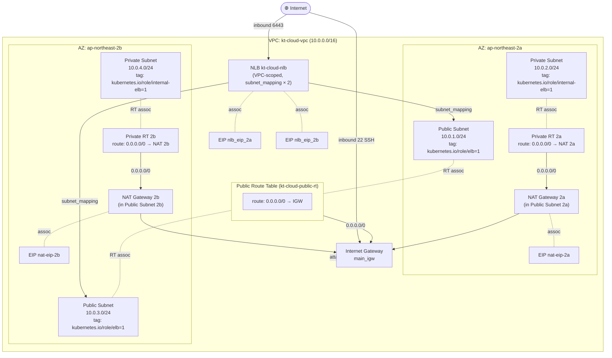
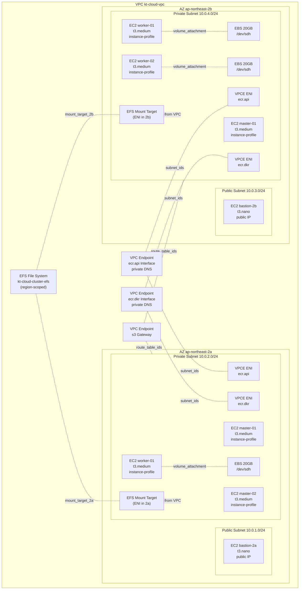
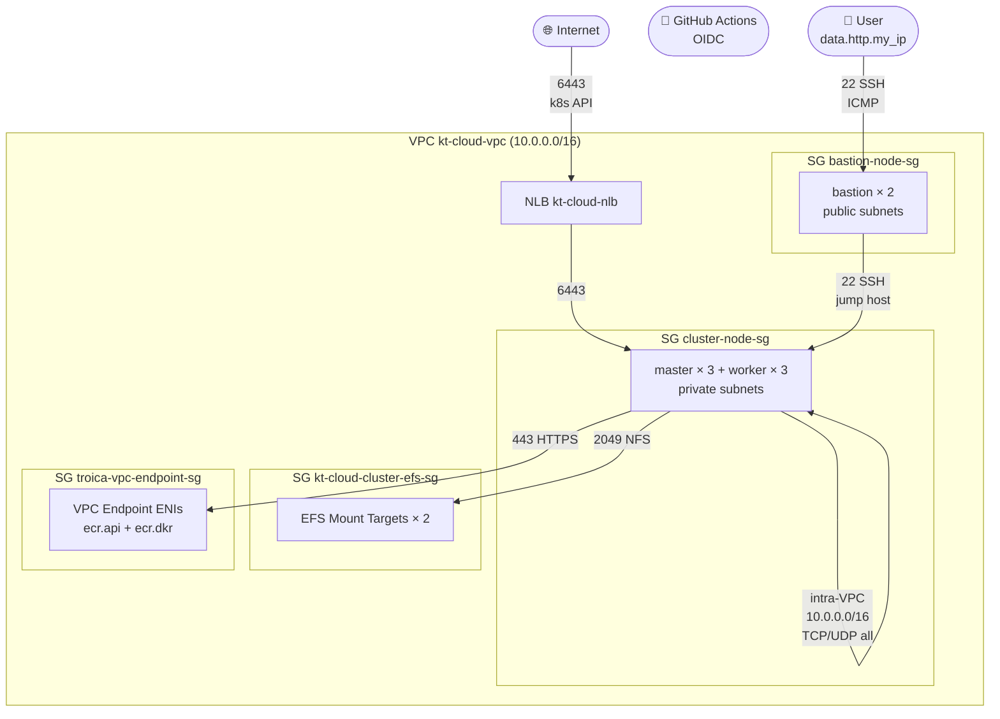
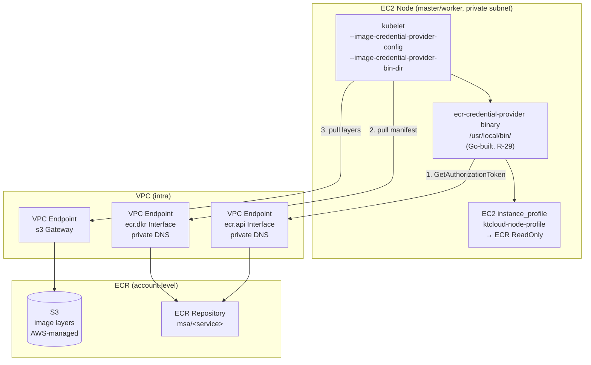
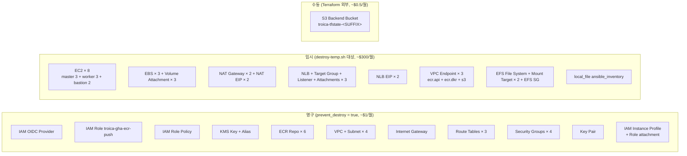
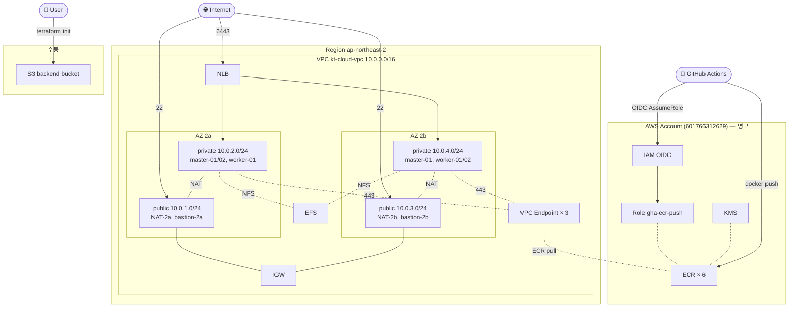

# Troica AWS Architecture (상세)

`msa-provisioning` Terraform이 만드는 모든 AWS 리소스를 레벨별로 분할 시각화.

> 검증 기준: 각 리소스의 정확한 scope (계정/리전/VPC/AZ/Subnet) + 트래픽 방향.
> 자세한 코드: [msa-provisioning/terraform](https://github.com/KTCloud-CloudNative-Troica-Team/msa-provisioning/tree/main/terraform)

---

## 1. Network 계층 (VPC + AZ + Subnet + Route)

**검증 포인트**:
- VPC CIDR `10.0.0.0/16`, AZ 2개 (2a/2b), public/private subnet 각 2개 = 총 4 subnet
- public RT 1개 공유 (0.0.0.0/0 → IGW)
- private RT 2개 (각 AZ별, 0.0.0.0/0 → 해당 AZ의 NAT)
- NLB는 VPC 레벨이지만 양 AZ public subnet에 매핑 (subnet_mapping × 2)



---

## 2. Compute + Storage (EC2 + EFS + EBS + VPC Endpoint)

**검증 포인트**:
- EC2 8대: master 3 (a:2 + b:1) + worker 3 (a:1 + b:2) + bastion 2 (a:1 + b:1)
- bastion만 public subnet (`associate_public_ip_address=true`)
- master/worker는 private subnet (IAM instance profile = `ktcloud-node-profile` with AmazonEC2ContainerRegistryReadOnly)
- EBS × 3: worker 노드에만 (20GB, /dev/sdh)
- EFS file system 1개 + Mount Target 2개 (각 AZ private subnet에 ENI)
- VPC Endpoint Interface × 2 (ecr.api + ecr.dkr): private DNS enabled, ENI는 양 AZ private subnet
- VPC Endpoint Gateway × 1 (s3): route table 매핑 (private RT 2a + 2b)



---

## 3. Security Groups + 트래픽 흐름

**검증 포인트**:
- 4 SG: `cluster-node-sg` (master/worker), `bastion-node-sg` (bastion), `kt-cloud-cluster-efs-sg` (EFS), `troica-vpc-endpoint-sg` (VPC Endpoint ENI)
- `cluster-node-sg`: 6443 from 0.0.0.0/0 (NLB ingress), intra-VPC TCP/UDP, ICMP, SSH from bastion-node-sg
- `bastion-node-sg`: SSH 22 + ICMP from user's IP (`data.http.my_ip`)
- `kt-cloud-cluster-efs-sg`: NFS 2049 from 10.0.0.0/16 (intra-VPC)
- `troica-vpc-endpoint-sg`: HTTPS 443 from 10.0.0.0/16 (intra-VPC)



---

## 4. CI/CD (계정 레벨 IAM + ECR + KMS — GitHub Actions OIDC flow)

**검증 포인트**:
- IAM OIDC Provider: `token.actions.githubusercontent.com` (계정 레벨, 단일)
- IAM Role `troica-gha-ecr-push`: name-based ARN (destroy/apply 사이클 안정)
- Trust policy: `repo:KTCloud-CloudNative-Troica-Team/msa-*:ref:refs/heads/main` 만 assume 허용
- Inline Policy: ECR push (BatchGetImage, PutImage, UploadLayerPart 등) on `repository/msa/*`
- 6개 ECR Repo: KMS encrypted (`AES_256` via `aws_kms_key.ecr`), IMMUTABLE tag, 30-image lifecycle
- 노드의 ECR pull은 별도 경로: EC2 instance profile에 `AmazonEC2ContainerRegistryReadOnly` attached (kubelet credential provider가 호출)

```mermaid
flowchart LR
  subgraph GH["GitHub Organization<br>KTCloud-CloudNative-Troica-Team"]
    direction TB
    Repo[msa-* repository<br>main branch push]
    Workflow[CI workflow<br>aws-actions/configure-aws-credentials]
    Repo --> Workflow
  end

  subgraph AWS["AWS Account 601766312629"]
    direction TB

    subgraph IAM["IAM (account-level)"]
      direction TB
      OIDC["OIDC Provider<br>token.actions.githubusercontent.com<br>thumbprint 6938fd4d..."]
      Role["IAM Role<br>troica-gha-ecr-push<br>Trust: repo:.../msa-*:ref:refs/heads/main"]
      Policy["Inline Policy<br>ecr-push:<br>GetAuthorizationToken<br>BatchGet/PutImage<br>UploadLayerPart"]
      OIDC -->|Federated principal| Role
      Role --> Policy
    end

    subgraph KMSGroup["KMS"]
      KMS[KMS Key ecr<br>rotation enabled<br>deletion_window 7d]
      Alias[Alias alias/troica-ecr]
      KMS --- Alias
    end

    subgraph ECRGroup["ECR Repositories (× 6, IMMUTABLE)"]
      direction TB
      ECR1[msa/user-service]
      ECR2[msa/auth-service]
      ECR3[msa/product-service]
      ECR4[msa/order-service]
      ECR5[msa/inventory-service]
      ECR6[msa/api-gateway]
    end

    Policy -.scoped to.- ECRGroup
    KMS -.encryption.- ECR1
    KMS -.encryption.- ECR2
    KMS -.encryption.- ECR3
    KMS -.encryption.- ECR4
    KMS -.encryption.- ECR5
    KMS -.encryption.- ECR6
  end

  Workflow -->|1. AssumeRoleWithWebIdentity<br>(STS)| OIDC
  Workflow -->|2. session credentials| Role
  Workflow -->|3. docker push| ECR3
```

---

## 5. EC2 노드의 ECR Image Pull (kubelet 경로)

**검증 포인트** — 위 CI/CD flow와 별개 (push vs pull 분리):
- EC2 instance profile `ktcloud-node-profile` → IAM Role (`ktcloud-cluster-node-role`, data source) → `AmazonEC2ContainerRegistryReadOnly` AWS managed policy attached
- kubelet에 ecr-credential-provider binary 설치 (R-29: Go 빌드 후 ansible copy)
- kubelet config `/etc/kubernetes/credential-provider-config.yaml`로 ECR matchImages 지정
- kubelet args `--image-credential-provider-config=...` 활성 (R-30: `kubeadm-flags.env` 통합)
- 트래픽 흐름: kubelet → ECR API/DKR (VPC Endpoint Interface) + 이미지 layer 다운로드는 S3 (VPC Endpoint Gateway)



---

## 6. 영구 / 임시 / 수동 자원 분류

**검증**: 비용 사이클(`destroy-temp.sh`) 시 무엇이 destroy되고 무엇이 유지되는지.



---

## 통합 토폴로지 (한 화면 요약)



---

## 검증 체크리스트 (다이어그램 작성 시 확인)

- ✅ VPC CIDR `10.0.0.0/16`, 4개 subnet CIDR 정확 (1/2/3/4 .0/24)
- ✅ public subnet에 IGW route (kt-cloud-public-rt 공유)
- ✅ private subnet에 NAT route (각 AZ별 분리)
- ✅ NLB는 subnet_mapping으로 양 AZ public subnet에 attach + 각 AZ EIP
- ✅ bastion은 public subnet (`associate_public_ip_address=true`)
- ✅ master/worker는 private subnet + instance profile
- ✅ EFS mount target은 private subnet ENI
- ✅ VPC Endpoint Interface(ecr.api/ecr.dkr)는 private subnet ENI, private DNS enabled
- ✅ VPC Endpoint Gateway(s3)는 route_table_ids 매핑 (private RT × 2)
- ✅ SG 4개 + 의도된 ingress rule 명시
- ✅ IAM OIDC + Role trust policy = `repo:.../msa-*:ref:refs/heads/main`
- ✅ ECR push (CI) vs ECR pull (kubelet)은 다른 경로 — 분리 표현
- ✅ 영구/임시/수동 자원 분류 정확
