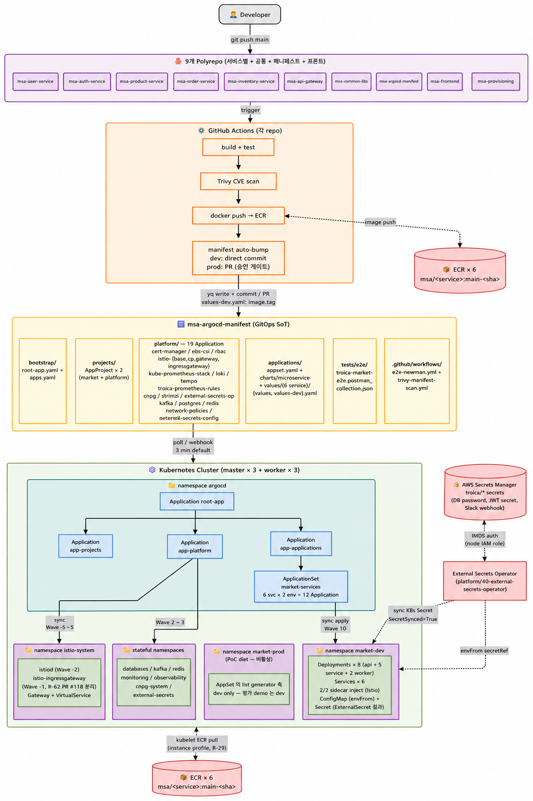
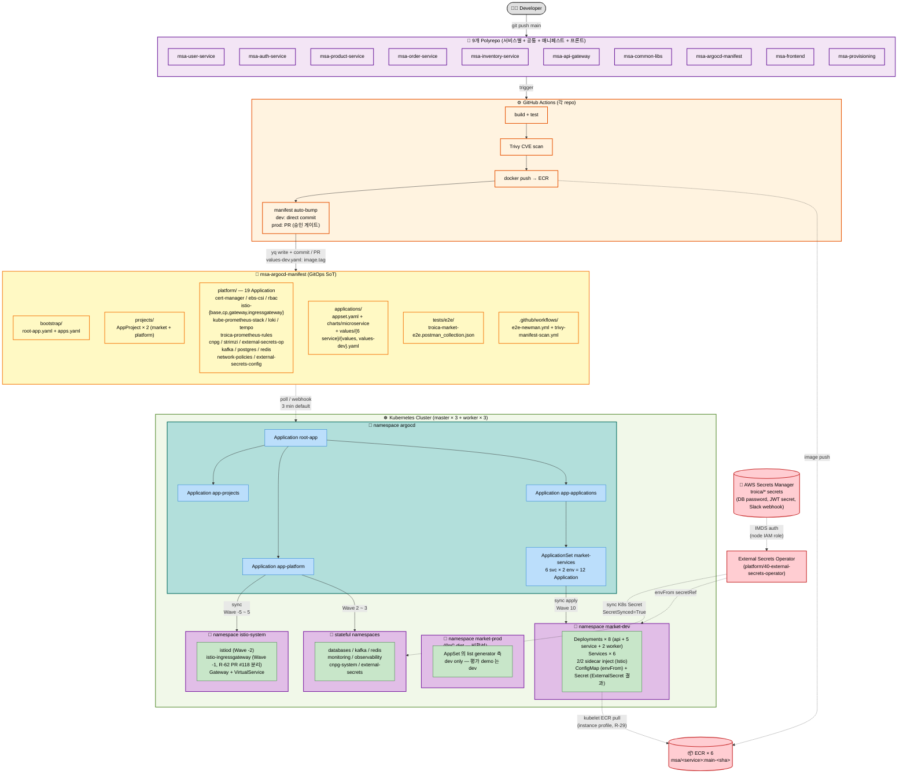

# Troica GitOps / ArgoCD 배포 흐름

6개 polyrepo + msa-argocd-manifest (단일 진실의 원천) + ArgoCD app-of-apps 가 어떻게 맞물려 클러스터까지 배포되는지 한 장 요약.

> 본 레포 README: [../../README.md](../../README.md)
> ArgoCD 설치: `msa-provisioning/ansible-playbook main.yaml` (Phase 0 ~ 1 자동화)

---

## 전체 흐름 (Developer → 클러스터)

---

## 단계별 설명

### 1. 개발자 commit
- 6개 polyrepo 중 하나의 `main` 브랜치에 push (직접 또는 PR merge)

### 2. CI (GitHub Actions) — 각 repo의 `.github/workflows/ci.yml`
- `build + test` (R-27 (a) 적용 후 ~2-3분)
- `Trivy CVE scan` (HIGH/CRITICAL gate)
- `docker push → ECR` (OIDC AssumeRole, `msa/<service>:main-<short-sha>` 태그)
- `manifest auto-bump`:
  - **dev**: msa-argocd-manifest의 `values-dev.yaml`을 **직접 commit** → 자동 배포
  - **prod**: `values-prod.yaml` 변경 **PR 생성** → 승인 게이트

### 3. msa-argocd-manifest (GitOps 단일 진실의 원천)
- `bootstrap/`: ArgoCD 진입점 (root-app + 3 child Application)
- `projects/`: AppProject CRD × 2 (market / platform)
- `platform/`: **19 Application** (Sync Wave -8 ~ 5):
  - **인프라 (3)**: 00-cert-manager / 05-ebs-csi / 05-rbac (Wave -8, R-48)
  - **Istio mesh (4)**: 10-istio-base (Wave -5, CRD) / 11-istio-cp (Wave -2, istiod only) / 12-istio-gateway (Wave -3, Gateway+VS+PeerAuth+DestinationRule+namespace label) / **13-istio-ingressgateway** (Wave -1, R-62 PR #118 분리)
  - **Observability (4)**: 30-kube-prometheus-stack / 30-loki / 30-tempo / 31-prometheus-rules (troica-prometheus-rules, R-47 AlertManager 룰)
  - **Operators (3)**: 40-cnpg-operator / 40-external-secrets-operator / 40-strimzi-operator
  - **Stateful (3)**: 50-kafka-cluster / 50-postgres-clusters / 50-redis-cluster
  - **Security (1)**: 60-network-policies (R-49 default-deny)
  - **Config (1)**: 91-external-secrets-config (R-25/R-33 service envFrom binding)
- `applications/`: 6 service Helm values (`values/<service>/values.yaml + values-dev.yaml`) + 공통 차트 (`charts/microservice/`)
- `tests/e2e/`: Newman collection + Postman 시나리오 7 step
- `.github/workflows/`: e2e-newman.yml (R-42) + trivy-manifest-scan.yml (R-46)

### 4. ArgoCD (cluster, namespace `argocd`)
- `root-app` Application이 본 레포 watch → 3 자식 Application 생성 (`app-projects` / `app-platform` / `app-applications`)
- `app-platform` 측 platform/ 디렉토리의 18 Application sync
- `app-applications` 측 ApplicationSet `market-services` sync
- ApplicationSet이 **6 service × {env: dev} = 6 Application** 자동 생성 (PoC diet — prod 일시 비활성, AppSet list generator 측)

### 5. ExternalSecrets 측 secret 동기화
- ESO operator (platform/40-external-secrets-operator) 가 ClusterSecretStore + 24 ExternalSecret 통해 AWS Secrets Manager 측 secret 을 K8s Secret 으로 sync
- IRSA 가 아닌 **IMDS 인증** (self-managed kubeadm 측, R-29 동일 패턴)
- 12 K8s Secret + 12 ConfigMap (envFrom secretRef + configMapRef) 자동 mount

### 6. K8s workload sync
- 각 Application이 `market-dev` namespace에 Deployment / Service / ConfigMap / Secret apply (Wave 10)
- platform 측 Application 들은 Wave -8 ~ 5 순서로 sync (stateful → service 의존성 보장)
- kubelet은 ECR에서 image pull (별도 경로 — instance profile 사용, [AWS-architecture §5 참조](./AWS-architecture.md))
- Istio sidecar 자동 inject (`istio-injection=enabled` namespace label) → pod 2/2 Running

---

## 검증 포인트

- ✅ CI는 image push **+** manifest commit/PR 두 작업 분리 (R-27 (a) 빌드 시간 최적화 적용 ~2분 25초)
- ✅ dev = direct commit (속도) / prod = PR (안전 게이트) — 환경별 정책 차등
- ✅ ApplicationSet으로 **6개 Application** 선언적 생성 (PoC diet — dev only. `values/<service>/` 만 만들면 자동)
- ✅ app-of-apps로 layered sync: projects → platform → applications (Wave 기반 순서)
- ✅ **istio-cp (Wave -2) 와 istio-ingressgateway (Wave -1) 분리** (R-62 PR #118) — multi-source race 영구 제거
- ✅ kubelet ECR pull은 ArgoCD와 별개 경로 (image-credential-provider, R-29/R-30)
- ✅ ArgoCD 자체는 ansible로 부트스트랩 (Phase 0~1) → 본 레포는 ArgoCD 설치를 가정
- ✅ AWS Secrets Manager → ExternalSecrets Operator (IMDS 인증, self-managed kubeadm) → K8s Secret → envFrom secretRef
- ✅ Newman E2E workflow (`.github/workflows/e2e-newman.yml`) workflow_dispatch trigger 시 baseUrl input + NLB DNS 측 cluster 호출 chain 검증

## 평가 18/18 통과 후 cluster 검증 흐름

발표 시연 path:
1. **Cluster up** → ansible (`msa-provisioning/ansible-playbook main.yaml`) → kubeadm + Calico + ArgoCD bootstrap
2. **ArgoCD root-app** → main 측 manifest 18 platform + 6 service Application 자동 sync
3. **ExternalSecrets** → Secrets Manager → 24 K8s Secret SecretSynced
4. **Istio mesh ready** → 8 service pod 2/2 (sidecar inject)
5. **외부 진입** → NLB DNS:80 → Istio Gateway → VirtualService 4 prefix → api-gateway
6. **검증**: Newman workflow 5/5 PASS + Grafana built-in dashboard + Prometheus targets + R-41 CB OPEN 시연
