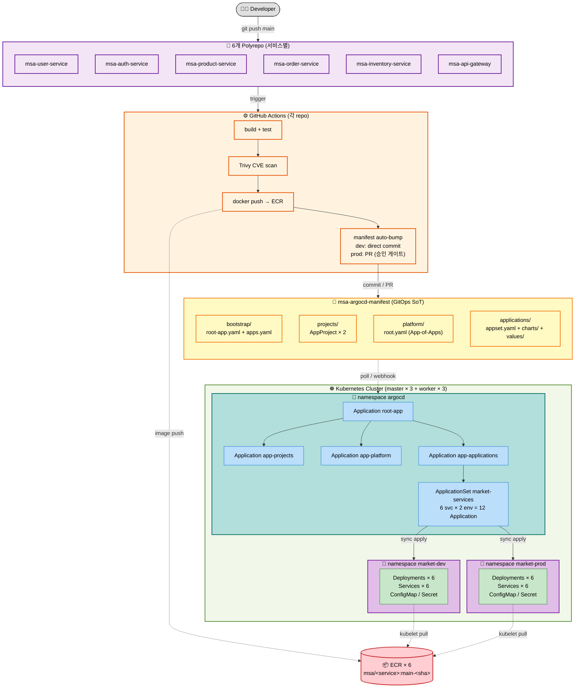

# Troica GitOps / ArgoCD 배포 흐름

6개 polyrepo + msa-argocd-manifest (단일 진실의 원천) + ArgoCD app-of-apps 가 어떻게 맞물려 클러스터까지 배포되는지 한 장 요약.

> 본 레포 README: [../../README.md](../../README.md)
> ArgoCD 설치: `msa-provisioning/ansible-playbook main.yaml` (Phase 0 ~ 1 자동화)

---

## 전체 흐름 (Developer → 클러스터)

---

## 단계별 설명

### 1. 개발자 commit
- 6개 polyrepo 중 하나의 `main` 브랜치에 push (직접 또는 PR merge)

### 2. CI (GitHub Actions) — 각 repo의 `.github/workflows/ci.yml`
- `build + test` (R-27 (a) 적용 후 ~2-3분)
- `Trivy CVE scan` (HIGH/CRITICAL gate)
- `docker push → ECR` (OIDC AssumeRole, `msa/<service>:main-<short-sha>` 태그)
- `manifest auto-bump`:
  - **dev**: msa-argocd-manifest의 `values-dev.yaml`을 **직접 commit** → 자동 배포
  - **prod**: `values-prod.yaml` 변경 **PR 생성** → 승인 게이트

### 3. msa-argocd-manifest (GitOps 단일 진실의 원천)
- `bootstrap/`: ArgoCD 진입점 (root-app + 3 child Application)
- `projects/`: AppProject CRD × 2 (market / platform)
- `platform/`: app-of-apps 패턴 (Phase 5에서 Postgres/Redis/Kafka 등 추가)
- `applications/`: 6 service × 2 env Helm values + 공통 차트

### 4. ArgoCD (cluster, namespace `argocd`)
- `root-app` Application이 본 레포 watch → 3 자식 Application 생성
- `app-applications`가 ApplicationSet `market-services`를 sync
- ApplicationSet이 **6 service × 2 env = 12 Application** 자동 생성

### 5. K8s workload sync
- 각 child Application이 `market-dev` 또는 `market-prod` namespace에 Deployment/Service/ConfigMap/Secret apply
- kubelet은 ECR에서 image pull (별도 경로 — instance profile 사용, [AWS-architecture §5 참조](./AWS-architecture.md))

---

## 검증 포인트

- ✅ CI는 image push **+** manifest commit/PR 두 작업 분리 (BACKLOG R-27 (a) 빌드 시간 최적화 적용)
- ✅ dev = direct commit (속도) / prod = PR (안전 게이트) — 환경별 정책 차등
- ✅ ApplicationSet으로 12개 Application 선언적 생성 (각 서비스 추가 시 `values/<service>/` 만 만들면 자동)
- ✅ app-of-apps로 layered sync: projects → platform → applications
- ✅ kubelet ECR pull은 ArgoCD와 별개 경로 (image-credential-provider, R-29/R-30)
- ✅ ArgoCD 자체는 ansible로 부트스트랩 (Phase 0~1) → 본 레포는 ArgoCD 설치를 가정
