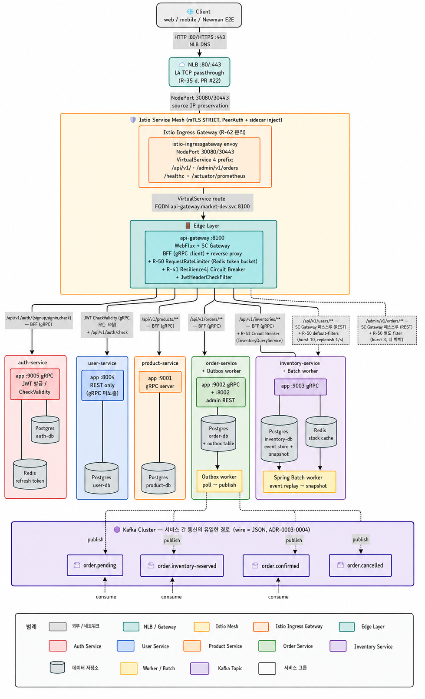
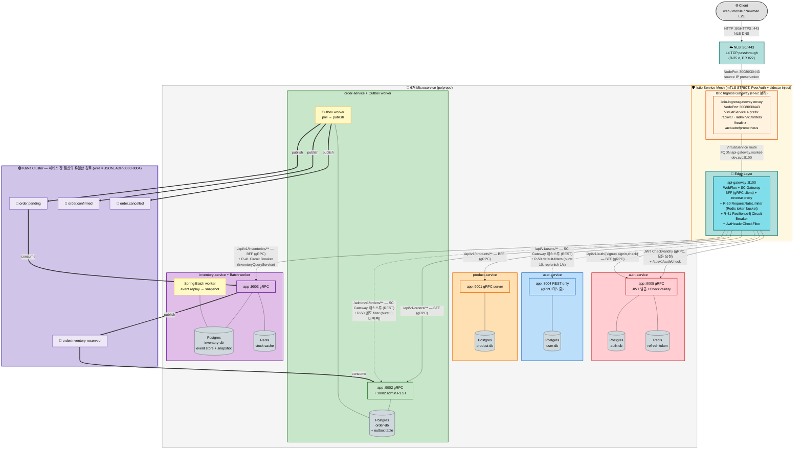

# Troica MSA 서비스 토폴로지

6개 마이크로서비스의 통신 경로 — api-gateway 진입, 서비스 내부 의존(DB/Redis), 서비스 간 통신(Kafka), 외부 진입 path (NLB → Istio → api-gateway).

> 핵심 메시지: **서비스 간 직접 호출은 없음**. inter-service 통신은 Kafka 토픽으로만. 외부 진입은 NLB → Istio Gateway → api-gateway 단일 path.
> ADR 참조: [ADR-0003 Kafka wire = JSON](../adr/0003-kafka-wire-json.md) · [ADR-0004 토픽명 표준](../adr/0004-kafka-topic-naming.md) · [ADR-0005 api-gateway BFF + SC Gateway 혼합](../adr/0005-api-gateway-bff-with-cloud-gateway.md) · [ADR-0006 order state machine](../adr/0006-order-state-machine-extension.md) · [ADR-0007 inventory Event Sourcing](../adr/0007-inventory-event-sourcing-batch-worker.md) · [ADR-0009 api-gateway ↔ Istio Mesh 책임 분담](../adr/0009-api-gateway-istio-mesh-collaboration.md) · [ADR-0010 보안 알림 채널 분리](../adr/0010-security-alerting-strategy.md)

---

## 토폴로지





---

## 통신 경로 분류

### 0. 외부 진입 path (NLB → Istio → api-gateway, ADR-0009)

```
Client → NLB DNS:80/:443 → NodePort 30080/30443 (worker) → istio-ingressgateway envoy
       → VirtualService (4 prefix) → api-gateway.market-dev.svc.cluster.local:8100
```

- **NLB**: L4 TCP passthrough, source IP preservation = true → SG 의 `30080/30443 from 0.0.0.0/0` 필수 (PR #22)
- **Istio VirtualService** (`platform/12-istio-gateway/manifests/virtualservice.yaml`) 의 4 prefix:
  - `/api/v1/` — api-gateway 의 SCG routes / BFF
  - `/admin/v1/orders` — order admin REST
  - `/healthz` — api-gateway actuator health (`management.endpoints.web.path-mapping`)
  - `/actuator/prometheus` — Spring Boot Micrometer (R-65 의존성 추가 후, PR #14/9/7/23/8/12)
- **mTLS STRICT** (PeerAuthentication) — service ↔ service 간 mesh 안 자동 mTLS
- **retries**: `attempts: 3, perTryTimeout: 5s, retryOn: 5xx,reset,connect-failure` (인프라 측 재시도, Resilience4j 와 별개 ADR-0009)

### 1. api-gateway → backend 분기 (BFF + SC Gateway 혼합, ADR-0005)

| 경로 | 패턴 | 방식 | ConfigMap key |
|---|---|---|---|
| `/api/v1/auth/{signup,signin,check}` | BFF (REST controller, gRPC client) | api-gateway → auth-service gRPC `:9005` | `GRPC_AUTH_SERVICE_ADDR` |
| `/api/v1/products/**` | BFF | api-gateway → product-service gRPC `:9001` | `GRPC_PRODUCT_SERVICE_ADDR` |
| `/api/v1/orders/**` | BFF | api-gateway → order-service gRPC `:9002` | `GRPC_ORDER_SERVICE_ADDR` |
| `/api/v1/inventories/**` | BFF + **R-41 CB** | api-gateway → inventory-service gRPC `:9003` + `InventoryQueryService` runCatching fallback | `GRPC_INVENTORY_SERVICE_ADDR` |
| `/api/v1/users/**` | SC Gateway 패스스루 + **R-50 default-filters** | api-gateway → user-service REST `:8004` (burst 10, replenish 1/s) | `ROUTE_USER_SERVICE_URI` |
| `/admin/v1/orders/**` | SC Gateway 패스스루 + **R-50 별도 filter (burst 3)** | api-gateway → order-service admin REST `:8002` | `ROUTE_ORDER_SERVICE_URI` |

- 모든 요청에 `JwtHeaderCheckFilter` 적용 → auth-service gRPC `CheckValidity` 호출 → ADR-0005
- **R-50 RequestRateLimiter 적용 범위 (api-gateway application.yaml 측 주석):**
  - **SCG default-filters** = `/api/v1/users` + `/admin/v1/orders` 측 양쪽 적용 (burst 10/3 차등)
  - **BFF 경로** (`/api/v1/auth`, `/products`, `/orders`, `/inventories`) 는 WebFlux controller 가 직접 처리 → SCG 안 거침 → ratelimit X (R-50 매니페스트 주석에 "발표 단계 한정 SC Gateway routes 만 cover, BFF 경로는 Resilience4j RateLimiter 또는 후속 WebFilter 로 보강 예정")
  - key resolver = `userKeyResolver` (Bearer token > client IP > "anonymous", `RateLimitKeyResolverConfig`)
- **R-41 Resilience4j Circuit Breaker**: `/api/v1/inventories/**` 측 `InventoryQueryService.runCatching` — backend down 시 빈 list fallback (110-280ms fail-fast = CB OPEN signature)

### 2. 서비스 간 (Kafka 토픽만)

| 토픽 | 발행자 | 구독자 | 의미 |
|---|---|---|---|
| `order.pending` | order Outbox worker | inventory-service | 주문 생성 — 재고 예약 요청 |
| `order.inventory-reserved` | inventory-service | order-service | 재고 예약 완료/실패 응답 |
| `order.confirmed` | order Outbox worker | (terminal) | 주문 확정 |
| `order.cancelled` | order Outbox worker | (terminal) | 주문 취소 |

→ ADR-0006 (order 7-state machine), ADR-0007 (inventory Event Sourcing + Batch)

### 3. 서비스 내부 의존 (각 서비스의 stateful backing)

| 서비스 | DB | 캐시/저장소 | 워커 |
|---|---|---|---|
| auth | Postgres (auth-db) | Redis (refresh token) | — |
| user | Postgres (user-db) | — | — |
| product | Postgres (product-db) | — | — |
| order | Postgres (order-db + outbox table) | — | **Outbox worker** (별 컨테이너, `--spring.profiles.active=worker`) |
| inventory | Postgres (inventory-db, event store + snapshot) | Redis (stock cache) | **Spring Batch worker** (event replay → snapshot) |

---

## 검증 포인트

### 통신 패턴
- ✅ **서비스 간 직접 gRPC 호출 0건** — 모든 서비스는 `grpc.server.port`만 가지고 client 설정 없음 (decoupling)
- ✅ 모든 inter-service 통신은 Kafka (eventual consistency, ADR-0003 wire=JSON)
- ✅ order ↔ inventory는 saga 패턴 — 2개 토픽으로 양방향 (요청 + 응답)
- ✅ order Outbox 패턴 — DB transaction 안에 이벤트 기록 → worker가 폴링 후 발행 (at-least-once 보장)
- ✅ inventory Event Sourcing — 이벤트 누적 + 주기적 snapshot (Spring Batch)
- ✅ api-gateway는 BFF (gRPC client) **+** SC Gateway (REST reverse proxy) 혼합 (ADR-0005)
- ✅ user-service는 REST만 노출 — api-gateway는 BFF 없이 SC Gateway 패스스루로 처리 (의도된 설계)
- ✅ auth-service `CheckValidity` gRPC는 매 요청마다 호출 — JWT 검증 중앙화

### 외부 진입 path
- ✅ **NLB source IP preservation** = true (instance target) → SG 의 `30080/30443 from 0.0.0.0/0` ingress 필수
- ✅ Istio VirtualService 4 prefix 만 envoy 측 매칭 — 그 외 path 는 envoy 404 (의도된 동작)
- ✅ VS destination FQDN = `api-gateway.market-dev.svc.cluster.local:8100` (cross-namespace)
- ✅ retries (인프라 측, ADR-0009) + Resilience4j (응용 측) 분리

### 회복성 + 보안
- ✅ **R-41 Circuit Breaker (기본 2-3·2-4)**: backend down 시 100-280ms fail-fast → 다른 service traffic 100% 격리
- ✅ **R-50 Rate Limit (기본 2-5)**: Redis token bucket — `x-ratelimit-*` header 노출
- ✅ **R-49 NetworkPolicy (심화 3-3)**: default-deny + 의도 통신만 allow — label/port mismatch 시 5s timeout
- ✅ **R-47 Slack #security-report (심화 2-3)**: AlertManager severity=security 라우팅 (ADR-0010)
- ✅ **Istio mTLS STRICT (심화 1-2)**: mesh 안 모든 통신 자동 mTLS (PeerAuthentication)
- ✅ **R-25/R-33 ExternalSecrets (심화 3-2)**: AWS Secrets Manager → ESO (IMDS 인증) → K8s Secret → envFrom

### Observability
- ✅ Spring Boot actuator `/healthz` (path-mapping) → liveness/readiness probe
- ✅ `/actuator/prometheus` → ServiceMonitor scrape (R-65 후속 — `micrometer-registry-prometheus` 의존성 추가 PR 머지 시점부터 활성)
- ✅ Grafana 측 Troica dashboard 6 panel (req rate / 5xx / P99 / Kafka lag / JVM heap / **R-41 CB state**) — R-65 PR 모두 머지 + cluster sync 후 data 표시
