# Troica MSA 서비스 토폴로지

6개 마이크로서비스의 통신 경로 — api-gateway 진입, 서비스 내부 의존(DB/Redis), 서비스 간 통신(Kafka).

> 핵심 메시지: **서비스 간 직접 호출은 없음**. inter-service 통신은 Kafka 토픽으로만.
> ADR 참조: [ADR-0003 Kafka wire = JSON](../adr/0003-kafka-wire-json.md) · [ADR-0004 토픽명 표준](../adr/0004-kafka-topic-naming.md) · [ADR-0005 api-gateway BFF + SC Gateway 혼합](../adr/0005-api-gateway-bff-with-cloud-gateway.md) · [ADR-0006 order state machine](../adr/0006-order-state-machine-extension.md) · [ADR-0007 inventory Event Sourcing](../adr/0007-inventory-event-sourcing-batch-worker.md)

---

## 토폴로지

```mermaid
flowchart TB
  Client([🌐 Client<br/>web / mobile])

  subgraph Edge["🚪 Edge Layer"]
    GW["api-gateway :8100<br/>WebFlux + SC Gateway<br/>BFF (gRPC client) + reverse proxy"]
  end

  subgraph Services["🧩 6개 Microservice (polyrepo)"]
    direction TB

    subgraph Auth["auth-service"]
      direction TB
      AuthApp["app :9005 gRPC<br/>JWT 발급 / CheckValidity"]
      AuthPG[("Postgres<br/>auth-db")]
      AuthRD[("Redis<br/>refresh token")]
      AuthApp --- AuthPG
      AuthApp --- AuthRD
    end

    subgraph User["user-service"]
      direction TB
      UserApp["app :8004 REST only<br/>(gRPC 미노출)"]
      UserPG[("Postgres<br/>user-db")]
      UserApp --- UserPG
    end

    subgraph Product["product-service"]
      direction TB
      ProdApp["app :9001 gRPC server"]
      ProdPG[("Postgres<br/>product-db")]
      ProdApp --- ProdPG
    end

    subgraph Order["order-service + Outbox worker"]
      direction TB
      OrderApp["app :9002 gRPC<br/>+ :8002 admin REST"]
      OrderPG[("Postgres<br/>order-db<br/>+ outbox table")]
      OrderWk["Outbox worker<br/>poll → publish"]
      OrderApp --- OrderPG
      OrderWk --- OrderPG
    end

    subgraph Inv["inventory-service + Batch worker"]
      direction TB
      InvApp["app :9003 gRPC"]
      InvPG[("Postgres<br/>inventory-db<br/>event store + snapshot")]
      InvRD[("Redis<br/>stock cache")]
      InvBatch["Spring Batch worker<br/>event replay → snapshot"]
      InvApp --- InvPG
      InvApp --- InvRD
      InvBatch --- InvPG
    end
  end

  subgraph KafkaBox["🟣 Kafka Cluster — 서비스 간 통신의 유일한 경로 (wire = JSON, ADR-0003·0004)"]
    direction LR
    TopicPending["📨 order.pending"]
    TopicReserved["📨 order.inventory-reserved"]
    TopicConfirmed["📨 order.confirmed"]
    TopicCancelled["📨 order.cancelled"]
  end

  Client -->|HTTPS| GW

  GW -->|"JWT CheckValidity (gRPC, 모든 요청)"| AuthApp
  GW -->|"/api/v1/auth/** — BFF (gRPC)"| AuthApp
  GW -->|"/api/v1/products/** — BFF (gRPC)"| ProdApp
  GW -->|"/api/v1/orders/** — BFF (gRPC)"| OrderApp
  GW -->|"/api/v1/inventory/** — BFF (gRPC)"| InvApp

  GW -.->|"/api/v1/users/** — SC Gateway 패스스루 (REST)"| UserApp
  GW -.->|"/admin/v1/orders/** — SC Gateway 패스스루 (REST)"| OrderApp

  OrderWk ==>|publish| TopicPending
  TopicPending ==>|consume| InvApp
  InvApp ==>|publish| TopicReserved
  TopicReserved ==>|consume| OrderApp
  OrderWk ==>|publish| TopicConfirmed
  OrderWk ==>|publish| TopicCancelled

  classDef client fill:#e0e0e0,stroke:#212121,color:#000
  classDef edge fill:#b2dfdb,stroke:#00695c,stroke-width:2px,color:#000
  classDef gw fill:#80deea,stroke:#006064,stroke-width:2px,color:#000
  classDef auth fill:#ffcdd2,stroke:#c62828,stroke-width:2px,color:#000
  classDef user fill:#bbdefb,stroke:#1565c0,stroke-width:2px,color:#000
  classDef product fill:#ffe0b2,stroke:#ef6c00,stroke-width:2px,color:#000
  classDef order fill:#c8e6c9,stroke:#2e7d32,stroke-width:2px,color:#000
  classDef inv fill:#e1bee7,stroke:#6a1b9a,stroke-width:2px,color:#000
  classDef store fill:#cfd8dc,stroke:#37474f,color:#000
  classDef worker fill:#fff9c4,stroke:#f9a825,color:#000
  classDef kafkaBox fill:#d1c4e9,stroke:#4527a0,stroke-width:3px,color:#000
  classDef topic fill:#ede7f6,stroke:#5e35b1,color:#000
  classDef svcGroup fill:#f5f5f5,stroke:#9e9e9e,color:#000

  class Client client
  class Edge edge
  class GW gw
  class Services svcGroup
  class Auth auth
  class User user
  class Product product
  class Order order
  class Inv inv
  class AuthApp auth
  class UserApp user
  class ProdApp product
  class OrderApp order
  class InvApp inv
  class AuthPG,UserPG,ProdPG,OrderPG,InvPG,AuthRD,InvRD store
  class OrderWk,InvBatch worker
  class KafkaBox kafkaBox
  class TopicPending,TopicReserved,TopicConfirmed,TopicCancelled topic
```

---

## 통신 경로 분류

### 1. 외부 → 클러스터 진입 (HTTPS, api-gateway만 노출)

| 경로 | 패턴 | 방식 |
|---|---|---|
| `/api/v1/auth/**` | BFF | api-gateway → auth-service gRPC `:9005` |
| `/api/v1/products/**` | BFF | api-gateway → product-service gRPC `:9001` |
| `/api/v1/orders/**` | BFF | api-gateway → order-service gRPC `:9002` |
| `/api/v1/inventory/**` | BFF | api-gateway → inventory-service gRPC `:9003` |
| `/api/v1/users/**` | SC Gateway 패스스루 | api-gateway → user-service REST `:8004` |
| `/admin/v1/orders/**` | SC Gateway 패스스루 | api-gateway → order-service REST `:8002` |

모든 요청에 `JwtHeaderCheckFilter`가 적용되어 auth-service gRPC `CheckValidity`를 호출. → ADR-0005

### 2. 서비스 간 (Kafka 토픽만)

| 토픽 | 발행자 | 구독자 | 의미 |
|---|---|---|---|
| `order.pending` | order Outbox worker | inventory-service | 주문 생성 — 재고 예약 요청 |
| `order.inventory-reserved` | inventory-service | order-service | 재고 예약 완료/실패 응답 |
| `order.confirmed` | order Outbox worker | (terminal) | 주문 확정 |
| `order.cancelled` | order Outbox worker | (terminal) | 주문 취소 |

→ ADR-0006 (order 7-state machine), ADR-0007 (inventory Event Sourcing + Batch)

### 3. 서비스 내부 의존 (각 서비스의 stateful backing)

| 서비스 | DB | 캐시/저장소 | 워커 |
|---|---|---|---|
| auth | Postgres (auth-db) | Redis (refresh token) | — |
| user | Postgres (user-db) | — | — |
| product | Postgres (product-db) | — | — |
| order | Postgres (order-db + outbox table) | — | **Outbox worker** (별 컨테이너, `--spring.profiles.active=worker`) |
| inventory | Postgres (inventory-db, event store + snapshot) | Redis (stock cache) | **Spring Batch worker** (event replay → snapshot) |

---

## 검증 포인트

- ✅ **서비스 간 직접 gRPC 호출 0건** — 모든 서비스는 `grpc.server.port`만 가지고 client 설정 없음 (decoupling)
- ✅ 모든 inter-service 통신은 Kafka (eventual consistency, ADR-0003 wire=JSON)
- ✅ order ↔ inventory는 saga 패턴 — 2개 토픽으로 양방향 (요청 + 응답)
- ✅ order Outbox 패턴 — DB transaction 안에 이벤트 기록 → worker가 폴링 후 발행 (at-least-once 보장)
- ✅ inventory Event Sourcing — 이벤트 누적 + 주기적 snapshot (Spring Batch)
- ✅ api-gateway는 BFF (gRPC client) **+** SC Gateway (REST reverse proxy) 혼합 (ADR-0005)
- ✅ user-service는 REST만 노출 — api-gateway는 BFF 없이 SC Gateway 패스스루로 처리 (의도된 설계)
- ✅ auth-service `CheckValidity` gRPC는 매 요청마다 호출 — JWT 검증 중앙화
